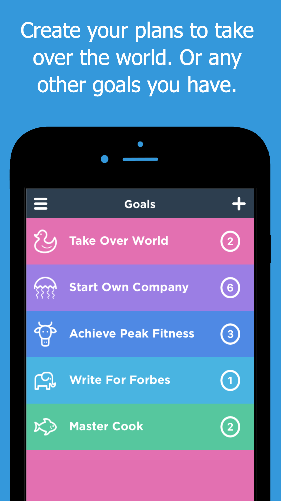
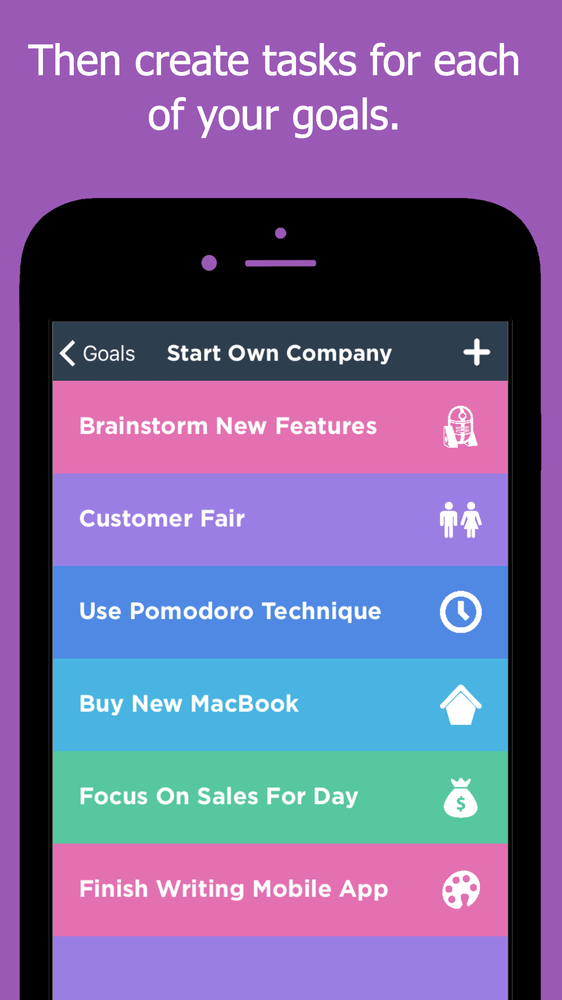
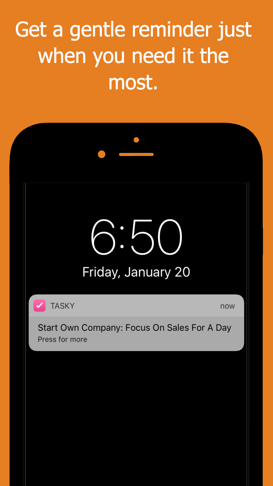
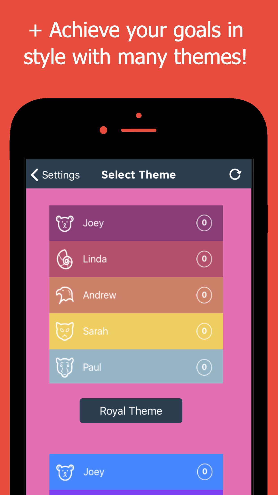

# Tasky Open Source iOS App (Habits, Goals & Tasks To-Do List Tracker)

Store Link: http://apple.co/2krwSkQ

Keeping your life in order shouldn't be hard.

Followed by gentle reminders just when you need them.

Its. that. simple. 
Get organised today. 

# Core Concept
1. You create goals you want to achieve.
2. And then create tasks for each of your goals.

# Broad Features
* Use separate goals & tasks to organize every aspect of your life.
* Personalize your goals & tasks with multiple themes.
* Useful list of all your goals & tasks
* Easy way to manage & track what you want to achieve
* Prioritise what is most important to you
* Beautiful, simple & colorful design
* Track your progress towards achieving a goal
* Free, and with no ads!

# Core Features
* Local notifications
* Payments

