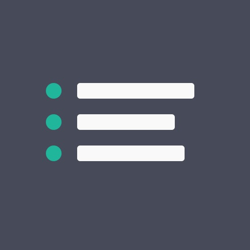
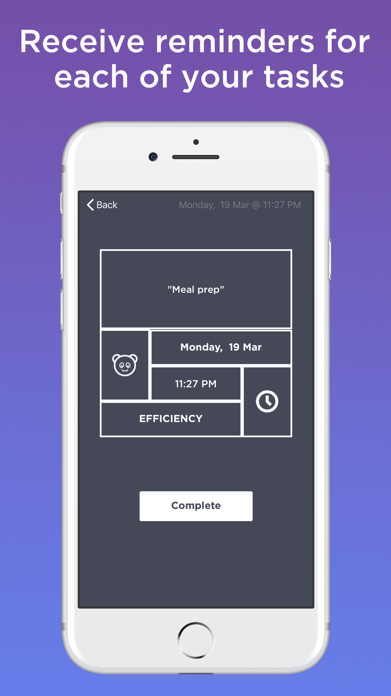
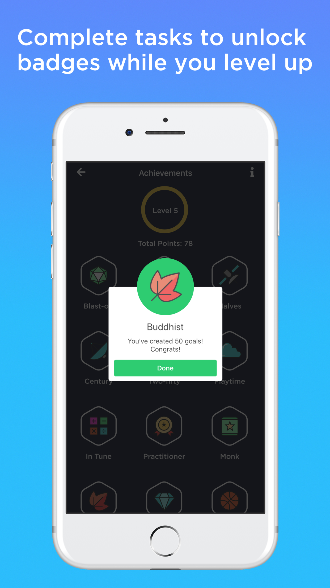
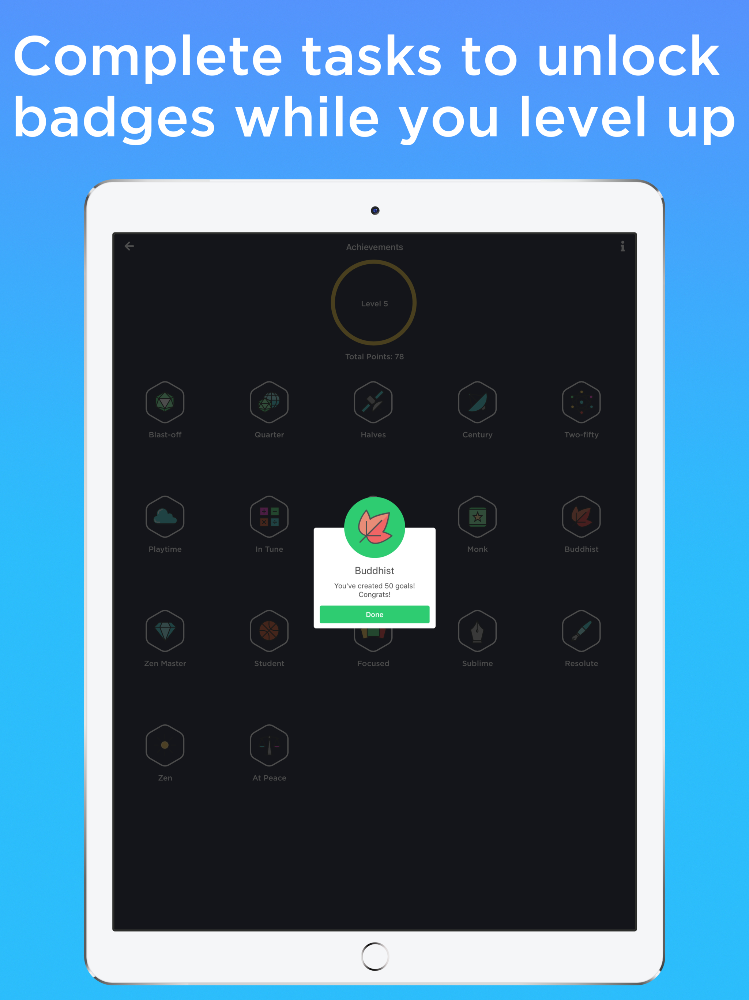

# Tasky: Your To-Do List Tracker - Habits, goals & life tasks

Store Link: http://apple.co/2krwSkQ

Keeping your life in order shouldn't be hard.

# About

Tasky allows you to organize your life with two simple concepts:
1. You create goals you want to achieve.
2. And then create tasks for each of your goals.

Followed by gentle reminders just when you need them.

Its. that. simple. 
Get organized today. 

# How It Works

- Use separate goals & tasks to organize every aspect of your life.
- Create categories of your to-do list and tick each of them off one by one.
- Create goals in all areas of your life. And make note of the tasks that you need to complete.
- Personalize your goals & tasks with multiple themes.
- Stay organized and get reminders at a scheduled time.

# Features

- A beautiful list of all your goals & tasks to keep you motivated.
- An easy way to manage & track what you want to achieve.
- Prioritise what is most important to you.
- Elegant, simple & colorful design.
- Track your progress towards achieving a goal.
• Free, and with no ads!

# Tasky Can Be Your

- Grocery shopping list
- Fitness regime schedule
- Car repair tasks
- Mobile app creation steps
- Download today and get the productivity boost you've been looking for.

 

# Tags
achieve,chores,checklist,errand,habit,gamification,list,organize,priority,project,remind,task,todo